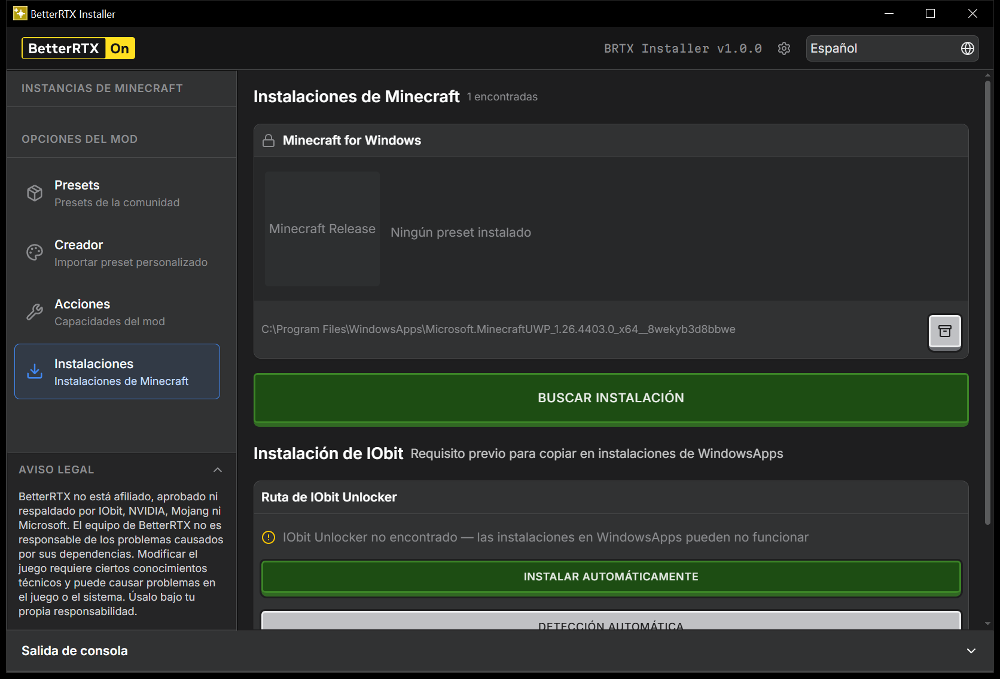
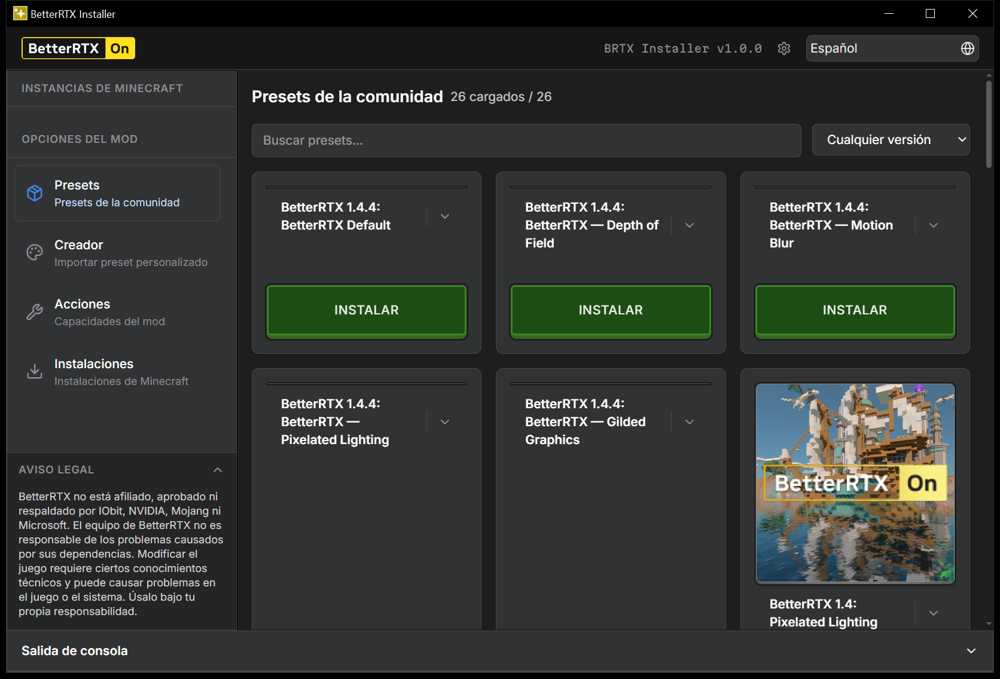
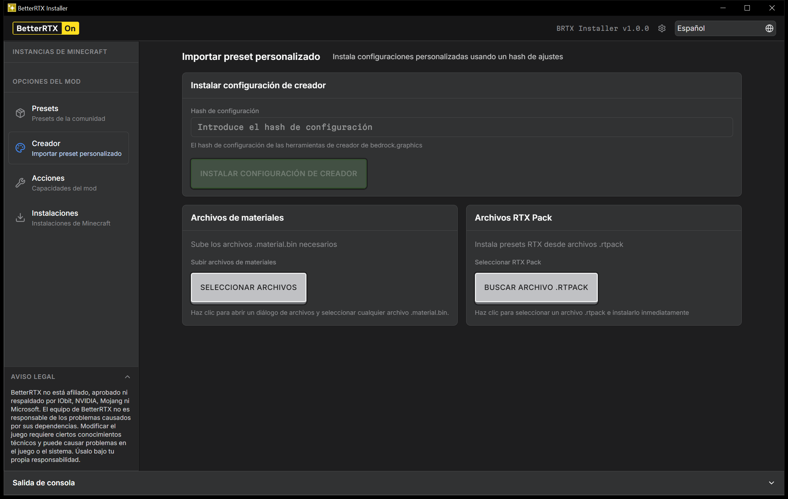
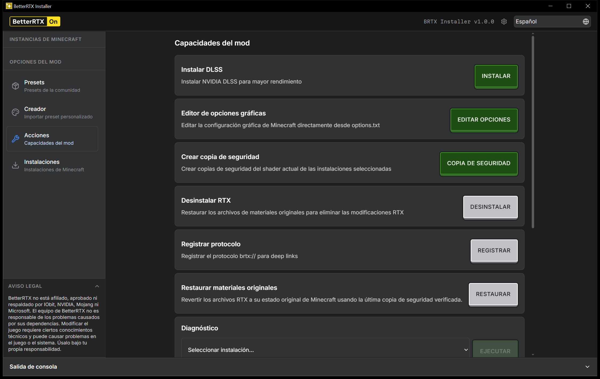

# BetterRTX Installer Enhanced


Instalador de escritorio portable para **BetterRTX** en Minecraft Bedrock (RTX), con
interfaz gráfica en un clic. Es un **fork comunitario y no oficial** de
[`BetterRTX/BetterRTX-Installer`](https://github.com/BetterRTX/BetterRTX-Installer)
(rama `v3`), reescrito con foco en robustez del motor de instalación, permisos
adaptativos en Windows, recuperación ante fallos y soporte en español.

> ⚠️ **Aviso importante:** este repositorio **no es el proyecto oficial de BetterRTX**.
> Es una versión modificada mantenida de forma independiente por **PGMPE (PLAYGAMEMPE)**.
> No está afiliado, respaldado ni soportado por los desarrolladores originales de
> BetterRTX, ni por NVIDIA, Mojang o Microsoft. Para el instalador oficial, usa
> siempre [BetterRTX/BetterRTX-Installer](https://github.com/BetterRTX/BetterRTX-Installer).

---

## Tabla de contenidos

- [¿Qué es BetterRTX?](#qué-es-betterrtx)
- [¿Qué cambia en esta edición?](#qué-cambia-en-esta-edición)
- [Capturas de pantalla](#capturas-de-pantalla)
- [Requisitos](#requisitos)
- [Instalación y uso](#instalación-y-uso)
- [Compilar desde el código fuente](#compilar-desde-el-código-fuente)
- [Arquitectura del backend](#arquitectura-del-backend)
- [Créditos y atribución](#créditos-y-atribución)
- [Licencia y avisos legales](#licencia-y-avisos-legales)

---

## ¿Qué es BetterRTX?

[BetterRTX](https://bedrock.graphics/) es un conjunto de shader packs que mejora
la iluminación de trazado de rayos (RTX) en Minecraft Bedrock Edition. Instalarlo
manualmente implica editar archivos `.material.bin` dentro de una carpeta protegida
por el sistema de permisos de UWP/Windows Store, un proceso técnico y fácil de
romper. El **BetterRTX Installer** oficial automatiza ese proceso con una interfaz
gráfica (Tauri + React + Rust).

Esta edición parte exactamente de esa base (v3, autoría original de
[Jason J. Gardner](https://github.com/jasonjgardner) y el equipo de BetterRTX) y
la extiende — ver la sección siguiente.

---

## ¿Qué cambia en esta edición?

Todo lo listado aquí es **específico de este fork** y no existe en el proyecto
oficial al momento de bifurcar. Se determinó comparando directamente el código
fuente de ambos repositorios, no solo la documentación.

### 1. Motor de instalación reescrito (antes: sobrescritura directa únicamente)

- **Motor híbrido** (`core/installer/`): intenta primero **`INDEX_REDIRECT`**, que
  parchea `materials.index.json` para apuntar a una subcarpeta `betterrtx/` en vez
  de tocar los `.material.bin` originales — instalación **no destructiva** y
  reversible con solo revertir el JSON. Si el índice no existe o no es válido, cae
  a **`DIRECT_OVERWRITE`** como respaldo (comportamiento equivalente al original),
  pero ahora siempre exige un backup verificado previo.
- **Journal de mutaciones** (`core/permissions/recovery.rs`): cada operación que
  toca el sistema de archivos queda registrada; si el proceso se interrumpe a mitad
  de una instalación, al reiniciar la app se detecta el journal abierto y se ofrece
  reparar/revertir automáticamente.

### 2. Sistema de backup con verificación de integridad

- `core/backup/`: antes de instalar, respalda los archivos originales en
  `.betterrtx-backup/<timestamp>/` junto a un `manifest.json` con el **SHA256 de
  cada archivo**. La restauración a vanilla verifica esos hashes antes de dar por
  buena la operación, en vez de confiar ciegamente en la copia.

### 3. Sistema adaptativo de permisos (antes: un solo camino de elevación)

`core/permissions/` implementa varios *providers* intercambiables, evaluados según
un escaneo real del entorno (`core/detection.rs`):

| Provider | Cuándo se usa |
|---|---|
| `XboxGamesProvider` | Instalaciones side-loaded / `C:\XboxGames` sin restricciones — la vía rápida, sin elevación. |
| `AclProvider` | Elevación ACL temporal nativa (`takeown`/`icacls`) sobre la carpeta protegida. |
| `UnlockerProvider` | Usa IObit Unlocker o LockHunter **solo si ya están instalados**, como último recurso — nunca obligatorio. |
| `StagedInstallProvider` | Escritura transaccional: copia a una carpeta temporal, valida, y hace *swap* atómico. |

### 4. Instalación silenciosa y automática de IObit Unlocker

El original requería que el usuario **descargara e instalara IObit Unlocker
manualmente** como prerrequisito. Esta edición, cuando el sistema lo necesita:

- Detecta si ya está instalado (registro de Windows) y qué versión.
- Si no está, lo **descarga desde el CDN oficial y lo instala en silencio**,
  detectando el tipo de instalador para aplicar los flags silenciosos correctos.
- Reporta progreso de descarga/instalación en tiempo real a la UI (eventos
  `streaming`), en vez de bloquear la interfaz.
- Expone un botón de desinstalación con tema de "acción peligrosa" en la UI.
- Elimina los diálogos UAC repetidos por operación: la app solicita elevación
  **una sola vez** (manifiesto embebido `requireAdministrator`, solo en build de
  release) y todos los procesos hijos heredan el token de administrador.

### 5. Diagnóstico, compatibilidad y migración (no existían en el original)

- **`core/compatibility/`**: valida antes de instalar que el preset elegido sea
  compatible con la instalación de Minecraft detectada, con advertencias no
  bloqueantes salvo condición crítica.
- **`core/diagnostics/crash_analyzer.rs`**: analiza el *Windows Event Log* en
  busca de errores de Minecraft de los últimos 7 días y los cruza con las fechas
  de los backups de BetterRTX para detectar posibles relaciones causa-efecto.
- **`core/migration/`**: registra la versión de Minecraft en cada instalación; si
  el juego se actualiza, marca la instalación como "necesita reaplicar preset" en
  vez de dejarla en un estado inconsistente sin avisar.

### 6. Benchmarks y estimación de FPS por GPU (función nueva)

- `core/benchmarks/`: detecta la GPU (nombre + VRAM vía WMI), la clasifica en
  tier High/Medium/Low y estima un rango de FPS esperable con BetterRTX activo.
  Guarda un historial local de mediciones del usuario (`BenchmarkPanel.tsx`).

### 7. Backend con manejo de errores y logging estructurado

- **`infra/error.rs`**: reemplaza el `Result<T, String>` plano del instalador
  oficial por un enum de error tipado que serializa `{ code, message,
  recoverable, suggestedAction }` hacia el frontend, permitiendo a la UI decidir
  cómo reaccionar en vez de solo mostrar texto.
- **`infra/logging.rs`**: logging estructurado con `tracing`, con rotación diaria
  a `logs/install.log`.

### 8. Interfaz y UX

- Modal de gestión de backups y restauración (`BackupsModal.tsx`).
- Barra de progreso en tiempo real durante instalaciones/desinstalaciones de IObit.
- Disclaimer inicial responsive con animación de colapso.
- Dimensiones de ventana por defecto/mínimas ajustadas (antes se podía redimensionar a un tamaño inutilizable).
- Detección de Minecraft vía registro de Windows en vez de invocar PowerShell (arranque más rápido).

### 9. Localización al español (idioma nuevo, no existía)

- Traducción completa de la interfaz (`public/locales/es/`).
- Auto-detección del idioma del sistema operativo para preseleccionar español o inglés.

### 10. Cadena de herramientas y automatización de build

- **Migración de `bun`/`npm` a `pnpm` v11**, con Node 22 LTS gestionado por
  proyecto (`.npmrc`, `.node-version`) sin afectar la instalación global del
  sistema, y un `preinstall` que bloquea cualquier gestor que no sea `pnpm`.

> Nada de lo anterior elimina funcionalidad del proyecto original: todos los
> cambios son **aditivos** sobre la base v3 oficial.

---

## Capturas de pantalla

| Instalaciones + gestión de IObit | Presets de la comunidad |
|---|---|
|  |  |

| Creador (preset personalizado) | Acciones (capacidades del mod) |
|---|---|
|  |  |

---

## Requisitos

### Para usar la aplicación (usuario final)

- Windows 10 (1809+) o Windows 11, 64-bit.
- Una instalación de Minecraft Bedrock **side-loaded** (recomendado:
  [MCLauncher](https://github.com/MCMrARM/mc-w10-version-launcher) o
  [Bedrock Launcher](https://github.com/BedrockLauncher/BedrockLauncher)) o la
  versión de Microsoft Store / Xbox App.
- Microsoft Edge WebView2 Runtime (preinstalado en Windows 11; la app puede
  instalarlo si falta).
- **No necesitas instalar IObit Unlocker manualmente**: esta edición lo gestiona
  automáticamente si tu instalación lo requiere.

### Para compilar desde el código fuente

| Herramienta | Versión mínima | Notas |
|---|---|---|
| Rust + MSVC | stable | requiere el linker de C++ Build Tools |
| Node.js | 22 LTS | gestionado por pnpm, no hace falta instalarlo aparte |
| pnpm | 11.1.3+ | gestor de paquetes obligatorio del proyecto |
| WebView2 Runtime | cualquiera | preinstalado en Windows 11 |

> **No uses `npm install`, `yarn` ni `bun`.** El proyecto bloquea cualquier
> gestor que no sea `pnpm` mediante el script `preinstall` y el campo
> `packageManager` de `package.json`.

---

## Instalación y uso

### Opción A — Descargar el instalador (recomendado)

1. Ve a la sección **[Releases](../../releases)** de este repositorio.
2. Descarga el instalador (`.exe` NSIS o `.msi`) o el ejecutable portable
   (`brtx-installer.exe`) para tu arquitectura.
3. Ejecuta el instalador o el `.exe` portable. La app pedirá elevación de
   administrador **una sola vez** al iniciar.
4. Selecciona tu instalación de Minecraft, elige un preset de BetterRTX y
   pulsa instalar. La app gestiona backup, permisos y desbloqueo de archivos
   automáticamente.

### Opción B — Compilar y ejecutar tú mismo

Ver [Compilar desde el código fuente](#compilar-desde-el-código-fuente) más abajo.

---

## Compilar desde el código fuente

El código de la aplicación vive en [`v3/`](v3/). Con Rust (+MSVC), pnpm 11+ y
Node 22 LTS instalados (ver [Requisitos](#requisitos)):

```bash
cd v3
pnpm install          # instala dependencias del frontend (bloquea npm/yarn/bun)
pnpm tauri dev         # modo desarrollo: hot-reload de frontend y backend
pnpm tauri build       # build de producción: .exe + instaladores NSIS/MSI en
                        # v3/src-tauri/target/release/bundle/
```

> **Nota:** este repositorio no incluye scripts `.bat` de automatización de
> entorno. Si prefieres un script que autodetecte e instale Rust, pnpm, Node y
> WebView2 por ti, puedes crear el tuyo propio en una carpeta `scripts/` local
> (ya está en `.gitignore`, así que no se subirá por accidente).

### Gestión de Node 22 LTS (aislado del sistema)

El archivo [`v3/.npmrc`](v3/.npmrc) configura `use-node-version=22.22.3`, lo que
le indica a pnpm que descargue y use Node 22.22.3 exclusivamente para este
proyecto sin modificar la versión global del sistema. El archivo
[`v3/.node-version`](v3/.node-version) sirve como referencia adicional para
herramientas compatibles (fnm, volta, etc.).

---

## Arquitectura del backend

Estructura modular en [`v3/src-tauri/src/`](v3/src-tauri/src/) (ver
[¿Qué cambia en esta edición?](#qué-cambia-en-esta-edición) para el detalle de
cada pieza):

| Módulo | Contenido |
|---|---|
| `infra/error.rs` | `AppError` tipado → `{ code, message, recoverable, suggestedAction }`. |
| `infra/logging.rs` | Logging estructurado con `tracing` → `logs/install.log`. |
| `core/integrity.rs` | Verificación de integridad SHA256. |
| `core/detection.rs` | Escaneo de capacidades del entorno (`CapabilityReport`). |
| `core/permissions/` | Providers `XboxGames`, `Acl`, `Unlocker`, `Staged` + `recovery::Journal`. |
| `core/installer/` | Motor híbrido `INDEX_REDIRECT` + `DIRECT_OVERWRITE`. |
| `core/backup/` | Backup verificado con manifest SHA256 + restauración a vanilla. |
| `core/compatibility/` | Verificación de compatibilidad previa a instalar. |
| `core/diagnostics/` | Analizador de crashes vía Windows Event Log. |
| `core/migration/` | Detección de cambios de versión de Minecraft. |
| `core/benchmarks/` | Detección de GPU y estimación de FPS. |

---

## Créditos y atribución

Este proyecto es un **derivado (fork)** de
[`BetterRTX/BetterRTX-Installer`](https://github.com/BetterRTX/BetterRTX-Installer),
creado originalmente por **Jason J. Gardner** ([@jasonjgardner](https://github.com/jasonjgardner))
y el equipo/comunidad de BetterRTX. La lista completa de autores, colaboradores,
traductores y playtesters originales está en el
[`CREDITS.md`](https://github.com/BetterRTX/BetterRTX-Installer/blob/main/CREDITS.md)
del repositorio oficial.

Las modificaciones descritas en la sección
[¿Qué cambia en esta edición?](#qué-cambia-en-esta-edición) son obra de
**PGMPE (PLAYGAMEMPE)**, mantenedor de este fork.

Recursos del proyecto original:

- Repositorio oficial: <https://github.com/BetterRTX/BetterRTX-Installer>
- Sitio de BetterRTX: <https://bedrock.graphics/>
- Discord de Minecraft RTX: <https://discord.com/invite/minecraft-rtx>

---

## Licencia y avisos legales

Este proyecto es un **trabajo derivado** de `BetterRTX-Installer`, distribuido
originalmente bajo la **GNU General Public License v3.0 (GPL-3.0)**. Como exige
la GPL-3.0 sobre las obras derivadas, **esta edición se distribuye bajo los
mismos términos, sin restricciones adicionales**: el texto completo, sin
modificar, está en [`LICENSE.md`](LICENSE.md).

**Aviso de modificación (GPLv3, sección 5a):** este software ha sido modificado
respecto al código fuente original de `BetterRTX/BetterRTX-Installer`. Los
cambios realizados por PGMPE están descritos en detalle en
[¿Qué cambia en esta edición?](#qué-cambia-en-esta-edición) de este mismo
documento, que cumple la función de aviso de modificación con fecha relevante
(historial de commits de este repositorio).

**Titularidad:**

- El código base, la arquitectura original v3 y el diseño de la interfaz
  provienen de `BetterRTX/BetterRTX-Installer` — © sus respectivos autores
  (ver [`CREDITS.md`](https://github.com/BetterRTX/BetterRTX-Installer/blob/main/CREDITS.md)
  del repositorio oficial).
- Los módulos, funcionalidades y modificaciones listados en este README como
  propios de esta edición fueron desarrollados por PGMPE sobre esa base, y se
  redistribuyen bajo la misma GPL-3.0, tal como exige la licencia.

**Sin garantía:** como establece la GPL-3.0 (secciones 15 y 16), este software
se distribuye **sin ningún tipo de garantía**, expresa o implícita.

**No afiliación:** esta es una versión **comunitaria y no oficial**. No está
afiliada, respaldada, revisada ni mantenida por los desarrolladores originales
de BetterRTX, ni por NVIDIA, Mojang o Microsoft. Cualquier problema específico
de esta edición debe reportarse en **este** repositorio, no en el del proyecto
oficial.
